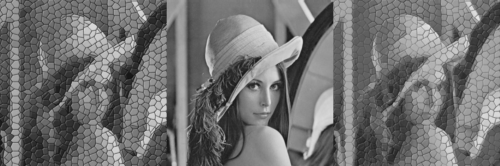

# Fast Local Laplacian Filter in python
This project is the implemtation of the work of Paris [1] in python.
this function require the following modules:

* opencv-python
* numpy

## Results

<figure class="image">
    
    <figcaption>orginal</figcaption>
    
    <figcaption>smoothed</figcaption>
    
    <figcaption>enhanced</figcaption>
</figure>

### Guided LLF

[1] Aubry, M., Paris, S., Hasinoff, S. W., Kautz, J., & Durand, F. (2014). Fast Local Laplacian Filters. ACM Transactions on Graphics, 33(5), 1–14. https://doi.org/10.1145/2629645
